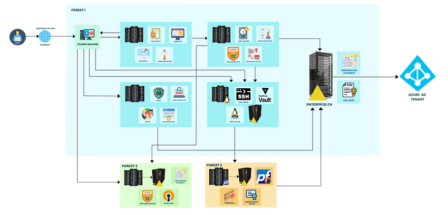

# CESP Certification

<figure><figcaption></figcaption></figure>





### **AD CS Price**

The cost of AD CS certification or related services can vary depending on several factors such as the level of certification, the training provider, and the geographical location.&#x20;

Prices might also differ for individuals and organizations.&#x20;

Always check with official providers for the most accurate and current pricing information.

### **AD CS Lab**

Hands-on experience is critical for mastering AD CS, and an AD CS lab provides a simulated environment to practice setup, configuration, and management of Certificate Services.&#x20;

The lab set-up typically includes various scenarios to emulate real-world challenges and tasks relevant to AD CS.

### **AD CS Exam**

Earning an AD CS certification requires passing a specific exam that tests your knowledge and skills in implementing and managing Microsoft Active Directory Certificate Services.&#x20;

The exam covers topics such as installation, configuration, management, and troubleshooting of AD CS.
