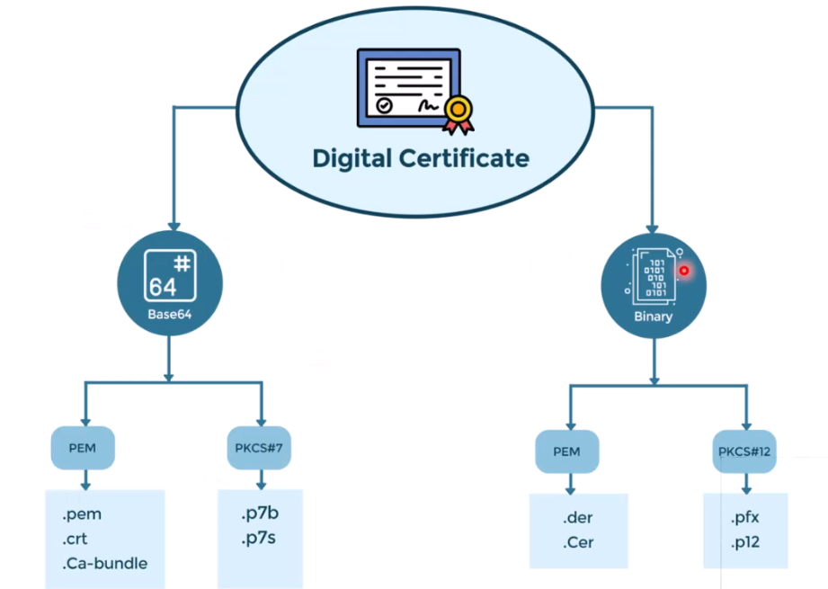

# 🟢 Certificate Formats

### Certificate Formats Explained

<figure><figcaption></figcaption></figure>

#### **PEM**

PEM (Privacy Enhanced Mail) is the most common format for X.509 certificates, RSA keys, and other types of data. It consists of Base64 encoded data between "BEGIN" and "END" lines.&#x20;

PEM format is suitable for text-based applications like email.

#### **DER - Binary format, equal to PEM but in binary**

DER (Distinguished Encoding Rules) is a binary form of PEM. It contains the same information as PEM but without the Base64 encoding, making it not human-readable.&#x20;

DER is commonly used in environments that require a more compact format.

#### **PFX/P12 (PKCS#12)**

PFX or P12 files are binary files that contain a certificate and its private key, sometimes with additional certificates forming a complete chain. They are protected with a password to secure the contained information.&#x20;

PFX/P12 is widely used for transporting and storing secured keys and certificates.

#### **P7B (PKCS#7)**

P7B files are used to share public certificates, including the certificate chain, in a single file. They do not contain private keys.&#x20;

P7B files are typically used in scenarios where certificate trusts must be established, such as adding trusted root certificates to a system.
