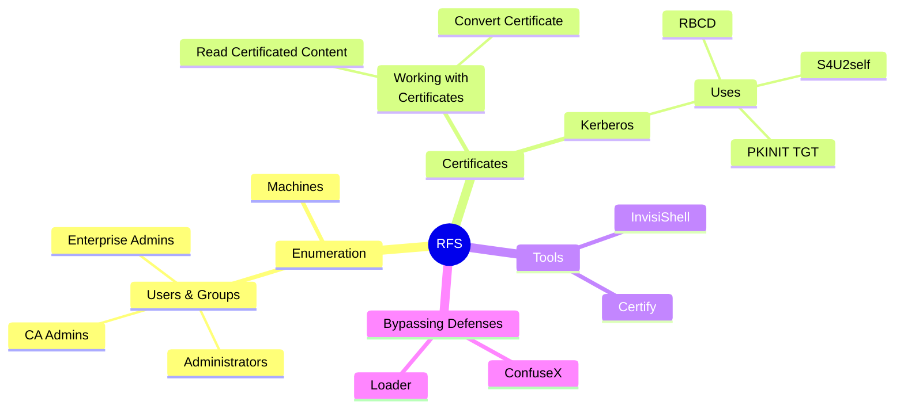

# Pwning
<ins class="adsbygoogle"
     style="display:block"
     data-ad-client="ca-pub-9236847887178276"
     data-ad-slot="6730727864"
     data-ad-format="auto"
     data-full-width-responsive="true">
</ins>
### Assumed Breach

After getting access into a machine we need to start understanding the system we are In!



### 1 - Enumerate Local Machine (Student VM)

Organize all the common tools you use bypass any PowerShell restrictions and start Enumerating.

Remember the Enumeration focus is data to help us attack AD CS.

#### Common Enumeration

* Local Users
* Domain Users
* Domain Machines
* Local VM Restrictions
* Where is the DC?
* Where is the CA?

**Local Users**

```
// Some code
```

**Domain Users**

```
// Some code
```

**Domain Machines**

<pre><code><strong>// Some code
</strong></code></pre>

**Local VM Restrictions**

```
// Some code
```

**Where is the DC?**

```
// Some code
```

**Where is the CA?**

```
// Some code
```
