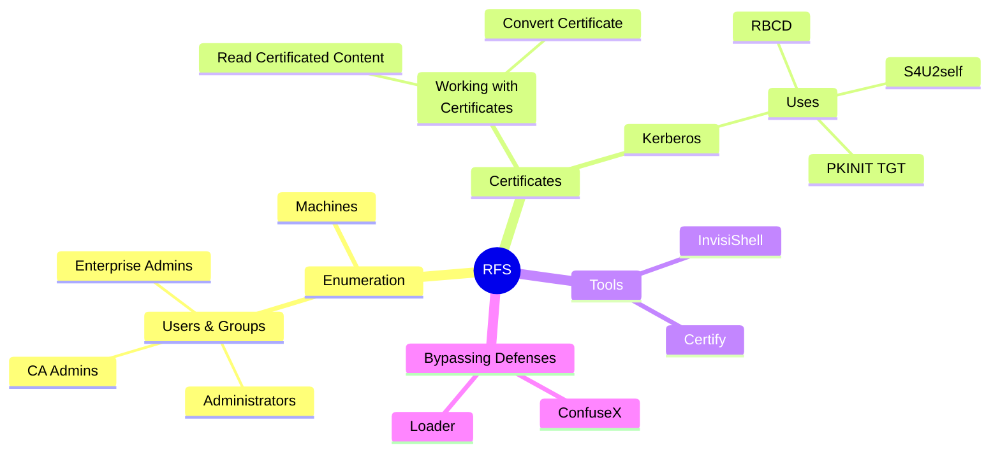

# Pwning

### Assumed Breach

After getting access into a machine we need to start understanding the system we are In!

Organize all the common tools you use and

```mermaid fullWidth="true"
---
title: CESP
---
mindmap
  root((RFS))
    Enumeration
      Machines
      Users & Groups
        Administrators
        Enterprise Admins
        CA Admins


    Certificates
      Working with<br/>Certificates
        Read Certificated Content
        Convert Certificate
      Kerberos
        Uses
            RBCD
            S4U2self
            PKINIT TGT
    Tools
      InvisiShell
      Certify

    Bypassing Defenses
      ConfuseX
      Loader

```
